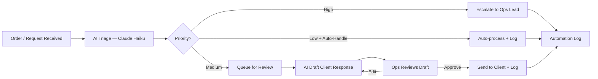

# eCom Agency Ops — Workflow Architecture

## Automation Flow

## 5-Layer Architecture

| Layer | Detail |
|-------|--------|
| **Trigger** | New order webhook / client email / form submission |
| **Input** | Order record (ID, client, type, value, items) + client message |
| **Processing** | Claude Haiku classifies priority, assigns next action, drafts response |
| **Output** | Updated order status, drafted reply ready for approval, log entry |
| **Verification** | Automation log entry per action; metrics dashboard shows auto-handle % |

## Production Extensions

- **Webhook trigger:** Shopify/WooCommerce order webhook → auto-triage on creation
- **CRM sync:** Push triaged order status to Notion/Airtable via API
- **Escalation:** Slack notification to ops lead for High-priority orders
- **Email integration:** Approved draft responses sent via Gmail/Outlook API
- **Daily report:** Automated summary of orders handled, auto-handle %, pending reviews
